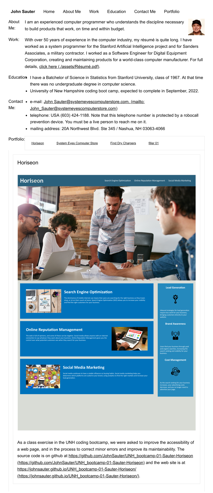

# UNH_bootcamp-02-Sauter-portfolio
Homework assignment 2: create a personal portfolio

This is a work in progress.  As the class proceeds
I will have more to add.

The application is on github at this URL: https://github.com/JohnSauter/UNH_bootcamp-02-Sauter-portfolio and is deployed at https://johnsauter.github.io/UNH_bootcamp-02-Sauter-portfolio/ .

Here is a screenshot of the application.  It does not convey the responsiveness
of the web page.

